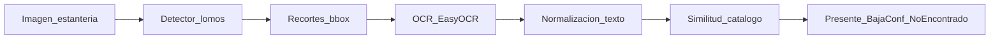

# Plan inicial del TP — Auditoría de inventario bibliográfico

Plan operativo. La definición de alcance está en [`definicion.md`](definicion.md). Este documento traduce ese alcance en fases, stack, métricas, hitos y entregables.

**Estado:** plan inicial (sin implementación de código aún).

---

## 1. Objetivo y prioridad

Construir un prototipo que, a partir de imágenes de estanterías:

1. **Núcleo (prioridad máxima):** detecte lomos y compare experimentalmente **dos** arquitecturas (mAP, precisión, recall, tiempo de inferencia).
2. **Extensión B:** recupere texto de los lomos detectados con OCR y evalúe esa recuperación de forma acotada.
3. **Extensión C:** cruce el texto con un catálogo demo mediante similitud de texto simple.

OCR y matching **no** compiten con el rigor del experimento de detección.

---

## 2. Pipeline



El detector usado en la demo es el de mejor **balance mAP / latencia** en validación (no necesariamente el de mayor mAP).

---

## 3. Decisiones fijas (stack)

| Decisión | Elección |
| :--- | :--- |
| Arquitectura A (one-stage) | **YOLOv8** (Ultralytics) |
| Arquitectura B (two-stage) | **Faster R-CNN** (torchvision) |
| Dataset | Roboflow [*Book Spine 2*](https://universe.roboflow.com/bookspine-fxfsx/book_spine_2) |
| Formatos | Export YOLO para A; conversión a COCO / API torchvision para B |
| Entorno de experimentos | Google Colab (GPU T4 como baseline declarado) |
| Código / reproducibilidad | Repositorio GitHub + `requirements.txt` + README |
| OCR | **EasyOCR** |
| Matching | Ratio de similitud (`rapidfuzz` o `difflib.SequenceMatcher`), umbral configurable |
| Catálogo | CSV/JSON de demostración (no ILS/OPAC real) |

---

## 4. Fases

### F0 — Setup

**Entradas:** definición de alcance, cuenta Roboflow/Colab, repo vacío o esqueleto.  
**Salidas:** dataset versionado/local con splits fijos; entorno Colab reproducible; semillas documentadas; layout de carpetas.

**Listo cuando:**

- *Book Spine 2* descargado y splits train/val(/test) congelados.
- Misma partición usable para YOLO y Faster R-CNN (vía conversión de anotaciones).
- Seed(s) y versión de librerías anotadas.

### F1 — Núcleo de detección (obligatoria)

**Entradas:** dataset + splits de F0.  
**Salidas:** pesos A y B; tabla comparativa; figuras de detecciones; elección del modelo demo.

**Trabajo:**

- Fine-tuning de YOLOv8 y Faster R-CNN sobre lomos.
- Evaluar al menos: **mAP**, **precisión**, **recall**, **tiempo de inferencia** (ms/imagen o FPS) en el mismo hardware declarado.
- Registrar hiperparámetros, épocas, tamaño de imagen y tiempo de entrenamiento.
- Justificar trade-offs (calidad vs. velocidad).

**Listo cuando:** existe una tabla A vs. B con las cuatro métricas y visualizaciones sobre val/demo; hay un modelo elegido para el pipeline.

### F2 — Extensión OCR

**Entradas:** detector elegido + imágenes de prueba.  
**Salidas:** texto por lomo; métrica/análisis de calidad en un subconjunto pequeño con GT manual; normalización mínima.

**Trabajo:**

- Recortar cada bbox → EasyOCR.
- Normalizar (minúsculas, quitar signos sobrantes) solo lo necesario para F3.
- Evaluar recuperación (p. ej. similitud vs. título de referencia en N crops etiquetados a mano) + ejemplos cualitativos (aciertos/fallos, texto vertical).

**Listo cuando:** hay evidencia cuantitativa acotada + ejemplos; se documentan limitaciones.

### F3 — Extensión matching

**Entradas:** textos OCR + catálogo demo.  
**Salidas:** etiqueta por lomo/título: *presente* / *baja confianza* / *no encontrado*.

**Trabajo:**

- Armar catálogo demo (lista de títulos).
- Matching por similitud de texto; umbral(es) configurables.
- Sin embeddings, sin retrieval avanzado, sin integración bibliotecaria real.

**Listo cuando:** demo punta a punta produce una salida interpretable de auditoría.

### F4 — Entregables del curso

**Entradas:** resultados F1–F3.  
**Salidas:** entregables de las [pautas del TP](../carpeta-referencias/Pautas_Trabajo_Practico_Final.pdf).

| Entregable | Notas |
| :--- | :--- |
| Paper IEEE (4–6 páginas) | Énfasis en resultados del **núcleo**; template en `carpeta-referencias/template-paper/` |
| Repo GitHub | Código limpio, README, `requirements.txt`, link/instrucciones del dataset |
| Video demo (≤ 2 min) | Narración en vivo en la defensa |
| Presentación (clase 8) | ~10 min + 2 min preguntas; todos los integrantes exponen |

**Listo cuando:** paper + repo + video cumplen el formulario/fecha del curso.

---

## 5. Layout sugerido del repositorio

```text
data/                 # raw / processed (o instrucciones de descarga; no commitear pesos enormes)
notebooks/            # experimentos Colab exportados (.ipynb)
src/                  # scripts: train, eval, convert_annotations, ocr, match
results/              # tablas, curvas, predicciones, figuras
demo/                 # script o notebook punta a punta + catálogo demo
docs/                 # opcional: notas de experimento
requirements.txt
README.md
concepto/             # definicion.md + Plan.md (este archivo)
```

---

## 6. Protocolo experimental (mínimo)

- **Splits fijos** desde F0; no re-particionar entre A y B.
- **Semillas** documentadas para entrenamiento e inferencia cuando aplique.
- **Hardware declarado** en tablas (p. ej. Colab T4); medir latencia en ese mismo entorno, con warmup y batch=1 salvo justificación.
- **Hiperparámetros** reportados (lr, epochs, imgsz, batch, augmentations básicas).
- **Comparación justa:** mismo conjunto de validación; reportar mAP@0.5 y, si es viable sin costo extra, mAP@0.5:0.95.
- **Modelo demo:** criterio explícito de selección (p. ej. maximizar mAP@0.5 sujeto a latencia &lt; umbral, o score compuesto documentado).

---

## 7. Referencias a usar

Índice y PDFs en [`carpeta-referencias/papers/`](../carpeta-referencias/papers/).

| Uso en el paper | Papers |
| :--- | :--- |
| Caso de aplicación / Introducción | `01` Yang 2024 (lomos), `02` YOLO+OCR 2025 |
| Arquitectura two-stage | `04` Faster R-CNN |
| Arquitectura one-stage / YOLOv8 | `06` Yaseen 2024 (+ `05` revisión YOLO si hace falta contexto) |
| OCR (marco teórico) | `08` CRNN |
| Protocolo de métricas tipo COCO | `09` COCO |
| Matching avanzado (solo para delimitar alcance) | `03` Ioli 2024 |

Resúmenes one-page: `Resumen_*.md` en la misma carpeta.

---

## 8. Riesgos y mitigaciones

| Riesgo | Fase | Mitigación |
| :--- | :--- | :--- |
| Gastar tiempo en OCR/matching antes de tener métricas de detección | F1 | Congelar F1 como gate: no abrir F2 hasta tener tabla A vs. B |
| Dataset grande / cuotas Colab | F0–F1 | Empezar con subset si hace falta para debug; entrenamiento final con split completo acordado |
| Domain gap Roboflow vs. estantería real | F1–F4 | Demo con imágenes del dataset + 1–2 fotos propias solo ilustrativas; documentar gap |
| OCR débil en texto vertical / tipografías raras | F2 | Reportar fallos; no construir un OCR custom |
| Matching sensible a errores de OCR | F3 | Umbral + clase “baja confianza”; catálogo chico y controlado |
| Faster R-CNN lento o difícil de cablear | F1 | Usar torchvision listo; reducir imgsz/epochs de forma simétrica y documentarlo |

---

## 9. Orden de trabajo inmediato (próxima semana)

- [ ] Crear esqueleto de carpetas del repo + `requirements.txt` mínimo (ultralytics, torch, torchvision, etc.).
- [ ] Descargar *Book Spine 2* desde Roboflow; fijar y documentar splits.
- [ ] Script/notebook de conversión de anotaciones YOLO → COCO para Faster R-CNN.
- [ ] Baseline: entrenar YOLOv8n/s pocas épocas; verificar mAP y figuras.
- [ ] Esqueleto de entrenamiento Faster R-CNN (torchvision) sobre el mismo split.
- [ ] Plantilla de tabla comparativa (mAP, P, R, latencia) en `results/`.
- [ ] Anotar en el README cómo reproducir el entorno Colab.

---

## 10. Criterio de avance global

El plan va bien si, en orden:

1. F1 produce una comparación experimental defendible entre YOLOv8 y Faster R-CNN.  
2. F2 muestra OCR usable sobre crops del modelo demo, con límites claros.  
3. F3 cierra una demo de auditoría con matching simple.  
4. F4 empaqueta evidencia (paper + repo + video) sin diluir el peso del núcleo.
