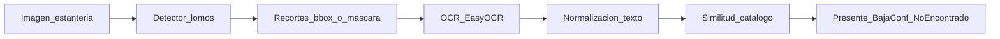

# Plan inicial del TP — Auditoría de inventario bibliográfico

Plan operativo. La definición de alcance está en [`definicion.md`](definicion.md). Este documento traduce ese alcance en fases, stack, métricas, hitos y entregables.

**Estado:** F1 (detección AABB) **cerrada** con tabla A vs. B. Siguiente: **F1bis** — exploración de segmentación (*YOLO26s-seg* vs *Mask R-CNN*) para mejorar recorte en densos/inclinados antes de F2 (OCR). Detalle de métricas AABB: [`guía-de-comparación.md`](guía-de-comparación.md).

---

## 1. Objetivo y prioridad

Construir un prototipo que, a partir de imágenes de estanterías:

1. **Núcleo (prioridad máxima):** detecte lomos y compare experimentalmente **dos** arquitecturas AABB (mAP, precisión, recall, tiempo de inferencia).
2. **Exploración de segmentación (F1bis):** tras F1, probar **dos** modelos con máscara para atacar fallos de densos/inclinados y el AABB holgado (ocupación ~0,54), con criterios propios (no sustituyen la tabla AABB).
3. **Extensión B:** recupere texto de los lomos detectados con OCR y evalúe esa recuperación de forma acotada.
4. **Extensión C:** cruce el texto con un catálogo demo mediante similitud de texto simple.

OCR y matching **no** compiten con el rigor del experimento de detección. La segmentación **no** reescribe F1: es una tabla aparte orientada al recorte / calidad de máscara.

---

## 2. Pipeline



El detector usado en la demo se elige con criterio explícito: primero el mejor **balance mAP / latencia** entre los AABB de F1; si F1bis muestra máscaras claramente mejores para OCR en densos/inclinados, el demo puede usar el modelo de segmentación ganador **solo para el recorte** (o punta a punta), documentando la elección.

El recorte **no** va al OCR como AABB crudo: el EDA muestra holgura y solape (sección 4.1). Antes de EasyOCR: encoger / banda central, **o máscara** si F1bis la aporta; rotar si el lomo no está vertical.

---

## 3. Decisiones fijas (stack)

| Decisión | Elección |
| :--- | :--- |
| Arquitectura A — AABB (F1) | **YOLOv8s** (Ultralytics), detección AABB |
| Arquitectura B — AABB (F1) | **Faster R-CNN ResNet-50 FPN v2** (torchvision) |
| Exploración C — seg (F1bis) | **YOLO26s-seg** (Ultralytics) |
| Exploración D — seg (F1bis) | **Mask R-CNN ResNet-50 FPN** (torchvision) |
| Dataset | Roboflow [*Book Spine 2*](https://universe.roboflow.com/bookspine-fxfsx/book_spine_2) **v4**, destino `dataset/` |
| Formatos | Export YOLO (polígonos) en `dataset/`; conversión a COCO **cajas** (y máscaras si hace falta) bajo `dataset/coco/` |
| Clase | Una sola (`1` = lomo). No hay títulos ni texto en las etiquetas |
| Resolución del export | 640×640; no bajar `imgsz` para ahorrar cómputo |
| Splits | Los de Roboflow v4 (no re-particionar) |
| Entorno de experimentos | Google Colab (GPU T4 como baseline declarado) |
| Código / reproducibilidad | Repositorio GitHub + `requirements.txt` + README |
| OCR | **EasyOCR** |
| Matching | Ratio de similitud (`rapidfuzz` o `difflib.SequenceMatcher`), umbral configurable |
| Catálogo | CSV/JSON de demostración (no ILS/OPAC real) |

**Dos tablas, no cuatro brazos mezclados:** (1) detección AABB A vs. B; (2) segmentación C vs. D para recorte. En el paper, F1 es el núcleo; F1bis se presenta como exploración motivada por el EDA y por los fallos densos/inclinados de F1.

---

## 4. Fases

### F0 — Setup

**Entradas:** definición de alcance, cuenta Roboflow/Colab, repo vacío o esqueleto.  
**Salidas:** dataset versionado/local con splits fijos; entorno Colab reproducible; semillas documentadas; layout de carpetas; EDA que justifique el protocolo.

**Hecho:**

- *Book Spine 2* v4 en `dataset/` (export YOLOv8, 1.656 imágenes). No re-descargar.
- Splits train/valid/test congelados (detalle en 4.1 y [`data/README.md`](../data/README.md)).
- Esqueleto de repo + `requirements.txt`.
- EDA en `notebooks/Dataset_y_EDA.ipynb` (split, ocupación polígono vs. caja, tamaño/aspecto, inclinación, solape).
- Conversión YOLO → COCO usable por Faster R-CNN / Mask R-CNN sobre los mismos splits (vía notebooks de entrenamiento).

**Pendiente menor (no bloquea F1/F1bis):**

- Seed(s) y versión de librerías anotadas de forma central en el README.
- Nota breve en el README de cómo reproducir Colab.

**Listo cuando:** dataset + splits + EDA disponibles (cumplido para avanzar).

### F1 — Núcleo de detección AABB (obligatoria) — **cerrada**

**Entradas:** dataset + splits de F0.  
**Salidas:** pesos A y B; tabla comparativa; figuras; lecturas; guía de comparación actualizada.

**Hecho:**

- Fine-tuning **YOLOv8s** (*Test YOLO8-AABB.ipynb*) y **Faster R-CNN** (*Test Faster R-CNN.ipynb*), una clase, `imgsz` ≥ 640, Colab T4.
- Métricas en validación: *mAP@0.5*, *mAP@0.5:0.95*, precisión, recall, latencia (batch=1); chequeo único en test; subconjuntos **denso** e **inclinado** con las mismas definiciones.
- NMS / `iou` más permisivo que 0,5 documentado en hiperparámetros.
- Tabla A vs. B y protocolo en [`guía-de-comparación.md`](guía-de-comparación.md).

**Resultados (síntesis):**

| | YOLOv8s (A) | Faster R-CNN (B) |
| :--- | ---: | ---: |
| *mAP@0.5* (val) | 0,822 | 0,800 |
| Precisión / recall (val) | 0,976 / 0,823 | 0,961 / 0,792 |
| Latencia (ms, T4) | ~14 | ~96 |
| *mAP@0.5* denso (val) | 0,620 | **0,679** |
| *mAP@0.5* inclinado (val) | 0,645 | 0,650 |

Lectura: resultados **positivos** en promedio (A gana en *mAP*/latencia; test acompaña a val). **Puntos a mejorar:** recall en densos/inclinados (caída clara en ambos) y AABB holgado para OCR (ocupación ~0,54). Eso motiva F1bis.

**Candidato demo desde F1 (AABB):** YOLOv8s por balance *mAP@0.5* / latencia, sujeto a revisión tras F1bis si las máscaras mejoran el recorte en escenas difíciles.

**Listo cuando:** tabla A vs. B + visualizaciones + lecturas — **cumplido**.

### F1bis — Exploración de segmentación (máscaras)

**Motivación:** F1 mostró buen promedio pero degradación en densos/inclinados; el EDA ya marcó que el AABB es ~2× el lomo. La máscara ataca sobre todo la **calidad del recorte** (y puede ayudar en inclinados); no se asume que suba solo el recall de detección.

**Entradas:** mismos splits v4; polígonos YOLO ya en `dataset/`.  
**Salidas:** pesos C y D; tabla de segmentación; figuras de máscara vs. caja; decisión documentada de si el demo usa máscara en F2.

**Modelos a comparar:**

| Brazo | Modelo | Rol |
| :--- | :--- | :--- |
| C | **YOLO26s-seg** (Ultralytics) | One-stage + máscara; continuación natural del stack YOLO |
| D | **Mask R-CNN ResNet-50 FPN** (torchvision) | Two-stage + máscara; continuación natural de Faster R-CNN |

**Trabajo:**

- Fine-tuning C y D sobre la misma partición; `imgsz` ≥ 640; hardware declarado (Colab T4).
- Reportar, como mínimo: *mAP* de caja y de máscara (si el framework lo da), precisión/recall a umbrales alineados al protocolo (0,5/0,5 donde aplique), latencia batch=1.
- **Subconjuntos denso e inclinado** con las mismas definiciones geométricas que F1.
- Métrica extra orientada a F2: calidad de recorte (p. ej. ocupación máscara vs. polígono GT, o solape con vecinos) en una muestra de densos/inclinados — no solo *mAP* global.
- Lecturas en el notebook (train, test o chequeo, subconjuntos) en el mismo estilo impersonal que F1.
- **No** mezclar C/D en la tabla AABB de F1. Tabla propia: “segmentación para recorte”.

**Listo cuando:** existe tabla C vs. D + figuras; hay decisión explícita: ¿F2 recorta con máscara del ganador de F1bis, o sigue con AABB encogido del ganador de F1?

### F2 — Extensión OCR

**Entradas:** detector/segmentador elegido + imágenes de prueba.  
**Salidas:** texto por lomo; métrica/análisis de calidad en un subconjunto pequeño con GT **manual**; normalización mínima.

**Trabajo:**

- Recortar cada instancia → EasyOCR. El dataset **no trae transcripciones**: etiquetar a mano un subconjunto chico (N crops de validación/demo).
- Preferir **máscara** si F1bis la validó; si no, encoger el ancho (~70–80 %) o banda central.
- Redimensionar el crop (ancho mínimo ~64–128 px). Probar rotación 90° si el texto es vertical; si la inclinación es alta, alinear al eje del lomo.
- EasyOCR con detección de orientación; no asumir texto vertical perfecto.
- Normalizar (minúsculas, quitar signos sobrantes) solo lo necesario para F3.
- Evaluar recuperación (similitud vs. título de referencia en esos N crops) + ejemplos cualitativos (aciertos/fallos, texto vertical, densos, inclinados).

**Listo cuando:** hay evidencia cuantitativa acotada + ejemplos; se documentan limitaciones.

### F3 — Extensión matching

**Entradas:** textos OCR + catálogo demo.  
**Salidas:** etiqueta por lomo/título: *presente* / *baja confianza* / *no encontrado*.

**Trabajo:**

- Armar catálogo demo (lista de títulos).
- Matching por similitud de texto; umbral(es) configurables.
- Marcar *baja confianza* si el recorte es dudoso (muy ancho, poco texto, o texto mezclado).
- Sin embeddings, sin retrieval avanzado, sin integración bibliotecaria real.

**Listo cuando:** demo punta a punta produce una salida interpretable de auditoría.

### F4 — Entregables del curso

**Entradas:** resultados F1, F1bis (si aplica), F2–F3.  
**Salidas:** entregables de las [pautas del TP](../carpeta-referencias/Pautas_Trabajo_Practico_Final.pdf).

| Entregable | Notas |
| :--- | :--- |
| Paper IEEE (4–6 páginas) | Énfasis en **F1** (AABB); F1bis como exploración motivada; OCR/matching acotados |
| Repo GitHub | Código limpio, README, `requirements.txt`, link/instrucciones del dataset |
| Video demo (≤ 2 min) | Narración en vivo en la defensa |
| Presentación (clase 8) | ~10 min + 2 min preguntas; todos los integrantes exponen |

**Listo cuando:** paper + repo + video cumplen el formulario/fecha del curso.

---

## 4.1 Dataset congelado (v4) — qué implica

Fuente: EDA en `notebooks/Dataset_y_EDA.ipynb`. Versión y splits también en [`data/README.md`](../data/README.md).

| Hecho | Número | Qué hacer con eso |
| :--- | :--- | :--- |
| Export | Roboflow **v4**, YOLOv8, 640×640, CC BY 4.0 | No re-descargar; no re-partir |
| Imágenes | 1.265 / 271 / 120 (76 % / 16 % / 7 %) | Comparar en **validación**; test = chequeo final |
| Lomos (polígonos) | 20.354 / 4.622 / 1.747 (~16 por foto) | El volumen alcanza; una sola clase; polígonos sirven a seg |
| Etiquetas | Polígono YOLO, no caja nativa | AABB COCO para Faster/Mask R-CNN; mAP de caja evalúa AABB holgadas |
| Ocupación polígono/caja (val) | media **0,54** (p10 0,18 / p90 0,92) | Motiva máscara o encoger caja antes del OCR |
| Forma de caja (val) | ~47×381 px; alto/ancho mediano **7,3** | Objeto alto y flaco; ~10 % de cajas más anchas que altas |
| Área COCO (val) | ~78 % “large”, ~2 % “small” | Filtrar por **ancho**, no por bucket COCO |
| Inclinación (val) | mediana ~3,7°; **~18 % > 45°** | Subconjunto inclinado + rotación de crop / máscara |
| Solape AABB (val) | IoU máximo mediano **0,27**; **76 %** IoU ≥ 0,1; **23 %** IoU ≥ 0,5 | NMS permisivo; métrica denso; máscara para no mezclar títulos |
| Texto | **No hay** GT de OCR | Subconjunto transcrito a mano en F2 |
| Fotos vacías | 21 train / 2 val / 3 test | Poco peso; no re-partir por esto |

No hace falta EDA de color ni t-SNE: no predicen mAP ni calidad del recorte.

---

## 5. Layout sugerido del repositorio

```text
dataset/              # Book Spine 2 v4 (YOLO); derivados p. ej. coco/; no commitear
notebooks/            # Dataset_y_EDA + Test Faster R-CNN + Test YOLO8-AABB + (F1bis seg)
src/                  # scripts: train, eval, convert_annotations, ocr, match
results/              # tablas, curvas, predicciones, figuras (faster_rcnn/, yolov8/, seg/)
demo/                 # script o notebook punta a punta + catálogo demo
docs/                 # opcional: notas de experimento
data/README.md        # descarga, versión v4 y splits congelados
requirements.txt
README.md
concepto/             # definicion.md + Plan.md + guía-de-comparación.md
```

---

## 6. Protocolo experimental (mínimo)

- **Splits fijos** desde F0 (v4); no re-particionar entre brazos.
- **Comparación en validación**; test una sola vez al cerrar cada experimento (F1 / F1bis).
- **Semillas** documentadas para entrenamiento e inferencia cuando aplique.
- **Hardware declarado** en tablas (p. ej. Colab T4); latencia con warmup y batch=1 salvo justificación.
- **Hiperparámetros** reportados (`learning_rate`, epochs, imgsz ≥ 640, batch, NMS/IoU, etc.).
- **F1 — comparación justa AABB:** mismo val; mAP@0.5 y, si es viable, mAP@0.5:0.95; P/R a score/conf ≥ 0,5 e IoU ≥ 0,5.
- **F1bis — tabla aparte:** no fusionar con A vs. B; incluir calidad de máscara/recorte además del mAP.
- **Subconjuntos:** denso (alto solape) e inclinado (> 45°) en F1 y F1bis.
- **Modelo demo:** criterio explícito (AABB por mAP/latencia; máscara si mejora densos/inclinados para OCR).

---

## 7. Referencias a usar

Índice y PDFs en [`carpeta-referencias/papers/`](../carpeta-referencias/papers/).

| Uso en el paper | Papers |
| :--- | :--- |
| Caso de aplicación / Introducción | `01` Yang 2024 (lomos), `02` YOLO+OCR 2025 |
| Arquitectura two-stage | `04` Faster R-CNN (+ Mask R-CNN / `07` si se cita la cabeza de máscara) |
| Arquitectura one-stage / YOLOv8 | `06` Yaseen 2024 (+ `05` revisión YOLO si hace falta contexto) |
| YOLO26 / seg (exploración) | Docs Ultralytics; no desplazar la cita central de v8 en F1 |
| OCR (marco teórico) | `08` CRNN |
| Protocolo de métricas tipo COCO | `09` COCO |
| Matching avanzado (solo para delimitar alcance) | `03` Ioli 2024 |

Resúmenes one-page: `Resumen_*.md` en la misma carpeta.

---

## 8. Riesgos y mitigaciones

| Riesgo | Fase | Mitigación |
| :--- | :--- | :--- |
| Gastar tiempo en OCR/matching antes de tener métricas de detección | F1 | F1 cerrada; no abrir F2 hasta decidir recorte (AABB o máscara tras F1bis) |
| Mezclar cuatro modelos en una sola tabla | F1bis | Dos tablas: AABB (F1) y seg (F1bis); paper con F1 como núcleo |
| Segmentación no mejora recall en densos | F1bis | Éxito = mejor recorte/OCR, no solo mAP; si no aporta, F2 usa AABB encogido |
| Dataset grande / cuotas Colab | F0–F1bis | Subset para debug; entrenamiento final con split v4 completo |
| Domain gap Roboflow vs. estantería real | F1–F4 | Demo con dataset + 1–2 fotos propias ilustrativas; documentar gap |
| AABB holgado → OCR mezcla vecinos | F1–F3 | F1bis máscaras; si no, encoger / banda central; *baja confianza* |
| NMS a IoU 0,5 borra lomos densos | F1 | NMS más permisivo; métrica en subconjunto denso |
| Lomos angostos e inclinados | F1–F2 | `imgsz` ≥ 640; rotar crop; máscara en inclinados |
| OCR débil en texto vertical / tipografías raras | F2 | Reportar fallos; no OCR custom; GT manual acotado |
| Matching sensible a errores de OCR | F3 | Umbral + “baja confianza”; catálogo chico |
| Test chico (120 fotos) | F1 / F1bis | No tunear con test; mAP de prueba = chequeo ruidoso |

---

## 9. Orden de trabajo inmediato

Tareas hechas se marcan; no se borran.

- [x] Crear esqueleto de carpetas del repo + `requirements.txt` mínimo.
- [x] Descargar *Book Spine 2* a `dataset/` (v4, skip si ya está).
- [x] Fijar y documentar splits en `data/README.md`.
- [x] EDA en `notebooks/Dataset_y_EDA.ipynb`.
- [x] Conversión / uso COCO para Faster R-CNN en el notebook de entrenamiento.
- [x] Entrenar y evaluar **YOLOv8s** AABB (*Test YOLO8-AABB.ipynb*).
- [x] Entrenar y evaluar **Faster R-CNN** (*Test Faster R-CNN.ipynb*).
- [x] Tabla A vs. B + subconjuntos denso/inclinado + guía de comparación.
- [ ] Notebook(s) F1bis: **YOLO26s-seg** y **Mask R-CNN** (mismo protocolo de splits / densos / inclinados).
- [ ] Tabla C vs. D (seg) + decisión de recorte para F2.
- [ ] Anotar en el README cómo reproducir Colab (semilla y versiones).
- [ ] Abrir F2 (OCR) con el recorte elegido.

---

## 10. Criterio de avance global

El plan va bien si, en orden:

1. **F1** produce una comparación defendible entre YOLOv8s y Faster R-CNN (AABB) — **cumplido**.  
2. **F1bis** produce una comparación C vs. D de segmentación con métricas de máscara/recorte y subconjuntos densos/inclinados, sin pisar la tabla de F1.  
3. **F2** muestra OCR usable sobre crops refinados (máscara o AABB encogido), con límites claros.  
4. **F3** cierra una demo de auditoría con matching simple y *baja confianza*.  
5. **F4** empaqueta evidencia (paper + repo + video) con el peso en el núcleo AABB y F1bis como exploración motivada.
