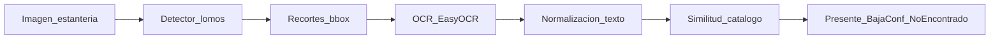

# Plan inicial del TP — Auditoría de inventario bibliográfico

Plan operativo. La definición de alcance está en [`definicion.md`](definicion.md). Este documento traduce ese alcance en fases, stack, métricas, hitos y entregables.

**Estado:** F0 en curso. Dataset v4 en `dataset/`, EDA hecho en `notebooks/Dataset_y_EDA.ipynb`. Falta conversión YOLO → COCO, semillas/versiones y el arranque de F1 (entrenamientos).

---

## 1. Objetivo y prioridad

Construir un prototipo que, a partir de imágenes de estanterías:

1. **Núcleo (prioridad máxima):** detecte lomos y compare experimentalmente **dos** arquitecturas (mAP, precisión, recall, tiempo de inferencia).
2. **Extensión B:** recupere texto de los lomos detectados con OCR y evalúe esa recuperación de forma acotada.
3. **Extensión C:** cruce el texto con un catálogo demo mediante similitud de texto simple.

OCR y matching **no** compiten con el rigor del experimento de detección.

---

## 2. Pipeline



El detector usado en la demo es el de mejor **balance mAP / latencia** en validación (no necesariamente el de mayor mAP).

El recorte **no** va al OCR como AABB crudo: el EDA muestra holgura y solape (sección 4.1). Antes de EasyOCR se encoge o se usa la banda central, y se rota si el lomo no está vertical.

---

## 3. Decisiones fijas (stack)

| Decisión | Elección |
| :--- | :--- |
| Arquitectura A (one-stage) | **YOLOv8** (Ultralytics), detección AABB — no es un tercer experimento de segmentación |
| Arquitectura B (two-stage) | **Faster R-CNN** (torchvision) |
| Dataset | Roboflow [*Book Spine 2*](https://universe.roboflow.com/bookspine-fxfsx/book_spine_2) **v4**, destino `dataset/` |
| Formatos | Export YOLO (polígonos) en `dataset/`; conversión a COCO **cajas** bajo `dataset/coco/` para B |
| Clase | Una sola (`1` = lomo). No hay títulos ni texto en las etiquetas |
| Resolución del export | 640×640; no bajar `imgsz` para ahorrar cómputo |
| Splits | Los de Roboflow v4 (no re-particionar) |
| Entorno de experimentos | Google Colab (GPU T4 como baseline declarado) |
| Código / reproducibilidad | Repositorio GitHub + `requirements.txt` + README |
| OCR | **EasyOCR** |
| Matching | Ratio de similitud (`rapidfuzz` o `difflib.SequenceMatcher`), umbral configurable |
| Catálogo | CSV/JSON de demostración (no ILS/OPAC real) |

---

## 4. Fases

### F0 — Setup

**Entradas:** definición de alcance, cuenta Roboflow/Colab, repo vacío o esqueleto.  
**Salidas:** dataset versionado/local con splits fijos; entorno Colab reproducible; semillas documentadas; layout de carpetas; EDA que justifique el protocolo.

**Hecho:**

- *Book Spine 2* v4 en `dataset/` (export YOLOv8, 1.656 imágenes). No re-descargar.
- Splits train/valid/test congelados (detalle en 4.1 y [`data/README.md`](../data/README.md)).
- Esqueleto de repo + `requirements.txt`.
- EDA en `notebooks/Dataset_y_EDA.ipynb` (split, ocupación polígono vs. caja, tamaño/aspecto, inclinación, solape).

**Pendiente para cerrar F0:**

- Conversión de anotaciones YOLO (polígono) → COCO (AABB) en `dataset/coco/`, misma partición.
- Seed(s) y versión de librerías anotadas.
- Nota en el README de cómo reproducir Colab.

**Listo cuando:** conversión COCO usable por Faster R-CNN sobre los mismos splits; semillas y versiones escritas.

### F1 — Núcleo de detección (obligatoria)

**Entradas:** dataset + splits de F0.  
**Salidas:** pesos A y B; tabla comparativa; figuras de detecciones; elección del modelo demo.

**Trabajo:**

- Fine-tuning de YOLOv8 y Faster R-CNN sobre lomos (una clase).
- Evaluar al menos: **mAP**, **precisión**, **recall**, **tiempo de inferencia** (ms/imagen o FPS) en el mismo hardware declarado.
- Comparar A vs. B **en validación**; test solo como chequeo final (120 fotos: mAP más ruidoso). No tunear hiperparámetros mirando test.
- Registrar hiperparámetros, épocas, tamaño de imagen y tiempo de entrenamiento. `imgsz` ≥ 640.
- Justificar trade-offs (calidad vs. velocidad).
- Ajustar NMS: un umbral ~0,5 borra lomos verdaderos (en validación, ~23 % de las cajas GT ya tienen IoU ≥ 0,5 con un vecino). Probar NMS más permisivo o *soft-NMS* y documentar el valor.
- Además del mAP global, reportar (aunque sea una tabla corta) el subconjunto **denso** (alto solape) y el **inclinado** (> 45°). El promedio esconde esos fallos.
- No leer “COCO-large” como objetos fáciles: el área es grande porque el lomo es **alto**, no ancho. Si se filtra, usar **ancho mínimo en píxeles**, no el bucket de área.

**Listo cuando:** existe una tabla A vs. B con las cuatro métricas y visualizaciones sobre val/demo; hay un modelo elegido para el pipeline.

YOLOv8-seg (máscaras) **no** entra como arquitectura C. Si más adelante sirve para recortar mejor en F2, es posproceso del modelo demo, no un tercer brazo del experimento.

### F2 — Extensión OCR

**Entradas:** detector elegido + imágenes de prueba.  
**Salidas:** texto por lomo; métrica/análisis de calidad en un subconjunto pequeño con GT **manual**; normalización mínima.

**Trabajo:**

- Recortar cada bbox → EasyOCR. El dataset **no trae transcripciones**: hay que etiquetar a mano un subconjunto chico (N crops de validación/demo).
- No usar el AABB crudo. Encoger el ancho (~70–80 %) o quedarse con la banda central; si hay máscara, recortar con ella.
- Redimensionar el crop (ancho mínimo ~64–128 px). Probar rotación 90° si el texto es vertical; si la inclinación es alta, alinear al eje del lomo.
- EasyOCR con detección de orientación; no asumir texto vertical perfecto.
- Normalizar (minúsculas, quitar signos sobrantes) solo lo necesario para F3.
- Evaluar recuperación (similitud vs. título de referencia en esos N crops) + ejemplos cualitativos (aciertos/fallos, texto vertical, recortes anchos que mezclan títulos).

**Listo cuando:** hay evidencia cuantitativa acotada + ejemplos; se documentan limitaciones.

### F3 — Extensión matching

**Entradas:** textos OCR + catálogo demo.  
**Salidas:** etiqueta por lomo/título: *presente* / *baja confianza* / *no encontrado*.

**Trabajo:**

- Armar catálogo demo (lista de títulos).
- Matching por similitud de texto; umbral(es) configurables.
- Marcar *baja confianza* si el recorte es muy ancho (aspecto &lt; 1, varios títulos en una caja), muy angosto con poco texto, o si conviven dos cadenas distintas (solape / holgura del AABB).
- Sin embeddings, sin retrieval avanzado, sin integración bibliotecaria real.

**Listo cuando:** demo punta a punta produce una salida interpretable de auditoría.

### F4 — Entregables del curso

**Entradas:** resultados F1–F3.  
**Salidas:** entregables de las [pautas del TP](../carpeta-referencias/Pautas_Trabajo_Practico_Final.pdf).

| Entregable | Notas |
| :--- | :--- |
| Paper IEEE (4–6 páginas) | Énfasis en resultados del **núcleo**; template en `carpeta-referencias/template-paper/` |
| Repo GitHub | Código limpio, README, `requirements.txt`, link/instrucciones del dataset |
| Video demo (≤ 2 min) | Narración en vivo en la defensa |
| Presentación (clase 8) | ~10 min + 2 min preguntas; todos los integrantes exponen |

**Listo cuando:** paper + repo + video cumplen el formulario/fecha del curso.

---

## 4.1 Dataset congelado (v4) — qué implica

Fuente: EDA en `notebooks/Dataset_y_EDA.ipynb`. Versión y splits también en [`data/README.md`](../data/README.md).

| Hecho | Número | Qué hacer con eso |
| :--- | :--- | :--- |
| Export | Roboflow **v4**, YOLOv8, 640×640, CC BY 4.0 | No re-descargar; no re-partir |
| Imágenes | 1.265 / 271 / 120 (76 % / 16 % / 7 %) | Comparar A vs. B en **validación**; test = chequeo final |
| Lomos (polígonos) | 20.354 / 4.622 / 1.747 (~16 por foto) | El volumen alcanza para fine-tuning; una sola clase |
| Etiquetas | Polígono YOLO, no caja nativa | Convertir a AABB COCO para Faster R-CNN; el mAP evalúa cajas holgadas |
| Ocupación polígono/caja (val) | media **0,54** (p10 0,18 / p90 0,92) | El AABB es ~2× el lomo; OCR sobre caja cruda mezcla vecinos |
| Forma de caja (val) | ~47×381 px; alto/ancho mediano **7,3** | Objeto alto y flaco; ~10 % de cajas más anchas que altas |
| Área COCO (val) | ~78 % “large”, ~2 % “small” | El área engaña: filtrar por **ancho**, no por bucket COCO |
| Inclinación (val) | mediana ~3,7°; **~18 % > 45°** | Dataset bimodal (parado vs. muy rotado), no “todo torcido” |
| Solape AABB (val) | IoU máximo mediano **0,27**; **76 %** IoU ≥ 0,1; **23 %** IoU ≥ 0,5 | NMS agresivo mata TP; recorte mezcla títulos |
| Texto | **No hay** GT de OCR | Subconjunto transcrito a mano en F2 |
| Fotos vacías | 21 train / 2 val / 3 test | Poco peso; no re-partir por esto |

No hace falta EDA de color ni t-SNE: no predicen mAP ni calidad del recorte.

---

## 5. Layout sugerido del repositorio

```text
dataset/              # Book Spine 2 v4 (YOLO); derivados p. ej. coco/; no commitear
notebooks/            # Dataset_y_EDA.ipynb + experimentos Colab
src/                  # scripts: train, eval, convert_annotations, ocr, match
results/              # tablas, curvas, predicciones, figuras
demo/                 # script o notebook punta a punta + catálogo demo
docs/                 # opcional: notas de experimento
data/README.md        # descarga, versión v4 y splits congelados
requirements.txt
README.md
concepto/             # definicion.md + Plan.md (este archivo)
```

---

## 6. Protocolo experimental (mínimo)

- **Splits fijos** desde F0 (v4); no re-particionar entre A y B.
- **Comparación en validación**; test una sola vez al cerrar F1.
- **Semillas** documentadas para entrenamiento e inferencia cuando aplique.
- **Hardware declarado** en tablas (p. ej. Colab T4); medir latencia en ese mismo entorno, con warmup y batch=1 salvo justificación.
- **Hiperparámetros** reportados (lr, epochs, imgsz ≥ 640, batch, NMS/IoU, augmentations básicas).
- **Comparación justa:** mismo conjunto de validación; reportar mAP@0.5 y, si es viable sin costo extra, mAP@0.5:0.95.
- **Subconjuntos:** además del promedio, denso (alto solape) e inclinado (> 45°).
- **Modelo demo:** criterio explícito de selección (p. ej. maximizar mAP@0.5 sujeto a latencia &lt; umbral, o score compuesto documentado). El mAP no alcanza para afirmar que el recorte es usable en OCR.

---

## 7. Referencias a usar

Índice y PDFs en [`carpeta-referencias/papers/`](../carpeta-referencias/papers/).

| Uso en el paper | Papers |
| :--- | :--- |
| Caso de aplicación / Introducción | `01` Yang 2024 (lomos), `02` YOLO+OCR 2025 |
| Arquitectura two-stage | `04` Faster R-CNN |
| Arquitectura one-stage / YOLOv8 | `06` Yaseen 2024 (+ `05` revisión YOLO si hace falta contexto) |
| OCR (marco teórico) | `08` CRNN |
| Protocolo de métricas tipo COCO | `09` COCO |
| Matching avanzado (solo para delimitar alcance) | `03` Ioli 2024 |

Resúmenes one-page: `Resumen_*.md` en la misma carpeta.

---

## 8. Riesgos y mitigaciones

| Riesgo | Fase | Mitigación |
| :--- | :--- | :--- |
| Gastar tiempo en OCR/matching antes de tener métricas de detección | F1 | Congelar F1 como gate: no abrir F2 hasta tener tabla A vs. B |
| Dataset grande / cuotas Colab | F0–F1 | Empezar con subset si hace falta para debug; entrenamiento final con split v4 completo |
| Domain gap Roboflow vs. estantería real | F1–F4 | Demo con imágenes del dataset + 1–2 fotos propias solo ilustrativas; documentar gap |
| AABB holgado (ocupación ~0,54) → recorte mezcla vecinos | F1–F3 | Encoger caja / banda central; *baja confianza* si el texto parece mezclado |
| NMS a IoU 0,5 borra lomos densos (~23 % GT con IoU ≥ 0,5) | F1 | NMS más permisivo o *soft-NMS*; métrica en subconjunto denso |
| Lomos angostos (~47 px) y ~18 % muy inclinados | F1–F2 | `imgsz` ≥ 640; rotar crop; no filtrar por área COCO |
| OCR débil en texto vertical / tipografías raras | F2 | Reportar fallos; no construir un OCR custom; GT manual acotado |
| Matching sensible a errores de OCR | F3 | Umbral + clase “baja confianza”; catálogo chico y controlado |
| Faster R-CNN lento o difícil de cablear | F1 | Usar torchvision listo; reducir epochs de forma simétrica (no `imgsz` por debajo de 640) y documentarlo |
| Test chico en fotos (120) | F1 | No tunear con test; tratar el mAP de prueba como chequeo ruidoso |

---

## 9. Orden de trabajo inmediato

Tareas hechas se marcan; no se borran.

- [x] Crear esqueleto de carpetas del repo + `requirements.txt` mínimo (ultralytics, torch, torchvision, etc.).
- [x] Descargar *Book Spine 2* a `dataset/` desde Roboflow (v4, skip si ya está).
- [x] Fijar y documentar splits (v4: 1.265 / 271 / 120) en `data/README.md`.
- [x] EDA del dataset (split, polígono vs. caja, tamaño, inclinación, solape) en `notebooks/Dataset_y_EDA.ipynb`.
- [ ] Script/notebook de conversión de anotaciones YOLO (polígono) → COCO (AABB) para Faster R-CNN.
- [ ] Baseline: entrenar YOLOv8n/s pocas épocas; verificar mAP y figuras (`imgsz` ≥ 640).
- [ ] Esqueleto de entrenamiento Faster R-CNN (torchvision) sobre el mismo split.
- [ ] Plantilla de tabla comparativa (mAP, P, R, latencia) en `results/`; dejar columnas para subconjunto denso / inclinado.
- [ ] Anotar en el README cómo reproducir el entorno Colab (semilla y versiones de librerías).

---

## 10. Criterio de avance global

El plan va bien si, en orden:

1. F1 produce una comparación experimental defendible entre YOLOv8 y Faster R-CNN.  
2. F2 muestra OCR usable sobre crops **refinados** del modelo demo, con límites claros (holgura, vertical, densos).  
3. F3 cierra una demo de auditoría con matching simple y *baja confianza* cuando el recorte es dudoso.  
4. F4 empaqueta evidencia (paper + repo + video) sin diluir el peso del núcleo.
